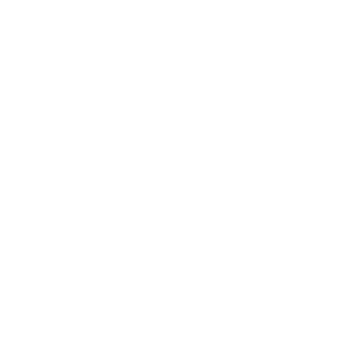

# IFRC Icon Stocks

## Icon Samples

### Color Icons
<table>
  <tr>
    <td></td>
    <td></td>
    <td></td>
  </tr>
  <tr>
    <td>Earthquake</td>
    <td>Flood</td>
    <td>Cash Assistance</td>
  </tr>
</table>

### Black and White Icons
<table>
  <tr>
    <td></td>
    <td></td>
    <td></td>
  </tr>
  <tr>
    <td>Earthquake</td>
    <td>Flood</td>
    <td>Cash Assistance</td>
  </tr>
</table>

### White Icons
<table>
  <tr>
    <td style="background-color: black;"></td>
    <td style="background-color: lightgray;"></td>
    <td style="background-color: lightgray;"></td>
  </tr>
  <tr>
    <td>Earthquake</td>
    <td>Flood</td>
    <td>Cash Assistance</td>
  </tr>
</table>
